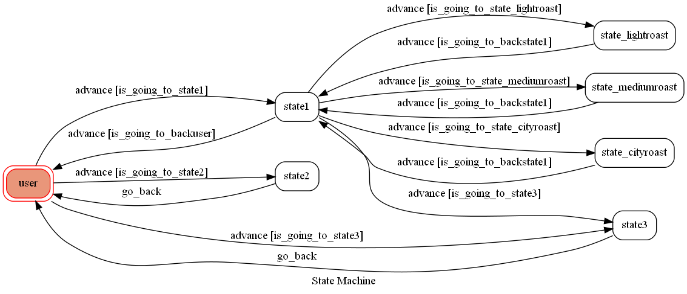

# TOC Project 2020

## 發想
在第三波咖啡浪潮後，精品咖啡的概念在世界各地興起，台灣，台灣也跟上了世界的腳步，單品自烘咖啡店林立，咖啡的定義也從原本又苦又澀的提神飲料轉變為生活情趣的一部份。
此Line機器人提供手沖沖煮方式以及咖啡店推薦的服務，期許讓人們能更容易踏入精品咖啡的世界。
## 介紹
### 基本資訊

#### 名稱
coffee
#### ID
@709xibzl
#### QR code

### 說明
#### user
輸入[沖煮技巧]->state1  
輸入[台南咖啡推薦]->state2->user  
輸入[說明]->state3->user  
#### state1 沖煮技巧
輸入[淺焙]->state_lightroast  
輸入[中焙]->state_mediumroast  
輸入[深焙]->state_cityroast  
輸入[離開]->user  
輸入[說明]->state3  
#### state_lightroast 淺焙
輸入[ok]->state1
#### state_mediumroast 中焙
輸入[ok]->state1
#### state_cityroast 深焙
輸入[ok]->state1
#### state2 台南咖啡推薦
#### state3 說明
### 實際運作

將會不定時更新咖啡廳資訊!敬請期待!
## Finite State Machine

