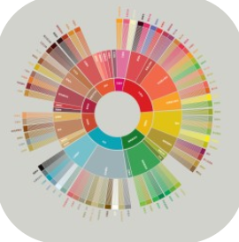

# TOC Project 2020

## 發想
在第三波咖啡浪潮後，精品咖啡的概念在世界各地興起，台灣，台灣也跟上了世界的腳步，單品自烘咖啡店林立，咖啡的定義也從原本又苦又澀的提神飲料轉變為生活情趣的一部份。
此Line機器人提供手沖沖煮方式以及咖啡店推薦的服務，期許讓人們能更容易踏入精品咖啡的世界。
## 介紹
### 基本資訊

#### 名稱
coffee
#### ID
@709xibzl
#### QR code

### 功能及操作

將會不定時更新咖啡廳資訊!敬請期待!
## Finite State Machine

